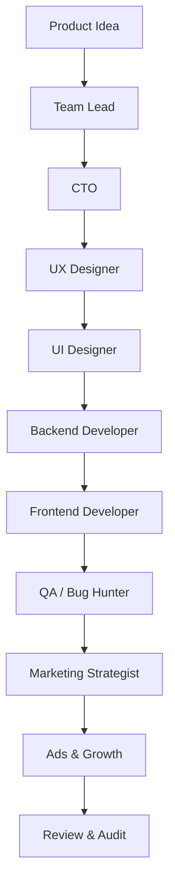

# Agentic Software Team

> A governance-first, agent-based AI framework that works like a real software company.

---

## 🌍 What is this?

**Agentic Software Team** is a governance-first framework for building software products
using multiple specialized AI agents that collaborate like a real-world software organization.

Instead of relying on a single prompt or autonomous AI, this project defines **explicit roles,
responsibilities, authority boundaries, and execution workflows** that mirror how professional
software teams actually plan, build, review, and ship products.

This repository represents the **organizational brain** of an AI-driven software company.

---

## 🎯 Why this exists

Most AI-driven development fails not because models are weak,
but because **organizational discipline is missing**.

Common failure modes:

- Unclear ownership and overlapping responsibilities
- Scope creep driven by unchecked autonomy
- Contradictory technical and product decisions
- Fast output with no review or audit trail
- Engineering disconnected from business goals

This framework addresses those issues by:

- Enforcing strict separation of concerns
- Defining leadership and veto boundaries
- Making execution predictable and reviewable
- Treating decisions and assumptions as first-class artifacts

The goal is not maximum speed —  
the goal is **correct, explainable, and production-grade output**.

---

## 🚀 Quick Start (No Setup Required)

This project does **not** require installation, deployment, or configuration.

Agentic Software Team is a **thinking and execution framework**, not a runtime tool.

### How to use it

1. Choose any LLM tool (ChatGPT, Cursor, Antigravity, etc.)
2. Open the role definition of the **Team Lead Agent**
3. Introduce your product idea
4. Follow the defined agent execution order
5. Pass outputs between agents as structured artifacts
6. Finish with the **Review & Audit Agent**

No servers.  
No bots.  
No automation required.

Automation and tooling are intentionally deferred to future versions.

---

## 👤 Who is this for?

- Solo developers building serious products with AI
- Technical founders validating SaaS ideas
- Small teams exploring agent-based workflows
- Engineers tired of chaotic, prompt-only AI usage

---

## 🧠 How it works (High Level)

1. A product idea is introduced
2. The **Team Lead Agent** defines intent and scope
3. The **CTO Agent** validates feasibility and architecture
4. **UX & UI Agents** design the user experience
5. **Backend & Frontend Agents** define implementation
6. The **QA Agent** identifies risks and defects
7. **Marketing & Ads Agents** plan go-to-market strategy
8. The **Review & Audit Agent** validates overall readiness

### Execution Flow



Each agent:

- Has a strictly defined role
- Produces explicit, reviewable outputs
- Operates within clear authority limits
- Hands off responsibility deliberately

No agent operates blindly or autonomously.

---

## 👥 Agent Roles

| Area | Agents |
|------|--------|
| Leadership | Team Lead, CTO |
| Product & Design | UX Designer, UI Designer |
| Engineering | Backend Developer, Frontend Developer |
| Quality | QA / Bug Hunter |
| Growth | Marketing Strategist, Ads & Growth |
| Control | Review & Audit |

All agent specifications are located in the `/agents` directory.

---

## 🧩 How to use this repository

This framework is **tool-agnostic**.
You can use it with:

- ChatGPT
- Cursor
- Antigravity
- Any LLM capable of following system instructions

### Typical usage flow

1. Read the agent role definitions
2. Start with the **Team Lead Agent**
3. Follow the defined execution order
4. Pass structured artifacts between agents
5. Finish with the **Review & Audit Agent**

This repository does **not** provide:
- a chatbot
- an automation engine
- a runtime platform

It provides a **thinking and execution model**.

---

## 🔐 Governance & Safety

Agentic Software Team is designed with **control, accountability, and traceability**
as first-class concerns.

This framework explicitly avoids blind automation.

### Core principles

- Clear authority boundaries between agents
- Human-in-the-loop checkpoints for critical decisions
- Explicit escalation paths for uncertainty or conflict
- No silent overrides or hidden assumptions
- Final authority rests with Review & Audit (and humans)

Relevant documents:

- `/rules/agent-governance.md`
- `/docs/agent-communication-model.md`
- `/docs/agent-memory-policy.md`
- `/decisions/`

---

## 🧠 Stateless Design & Decision Traceability

Agents do **not** maintain persistent internal memory.

Instead:
- State is externalized as explicit artifacts
- Decisions are logged in version control
- Rationale remains visible and auditable

This design:
- Prevents hallucination persistence
- Enables deterministic execution
- Makes debugging and review possible

---

## 📂 Repository Structure

```text
agents/        # AI role definitions
rules/         # Governance and control rules
workflows/     # Agent execution flows
prompts/       # Reusable prompt templates
examples/      # Example projects and outputs
docs/          # Extended documentation
decisions/     # Architecture and decision logs
```

---

## 🧠 Positioning

Agentic Software Team is not a chatbot, code generator, or AutoGPT variant.

It is a **governance-first, AI-native software development framework**
designed to simulate how real software teams:

- think
- decide
- review
- and ship

Automation comes later.  
Architecture comes first.

---

## 📜 License

This project is licensed under the **GNU AGPL v3.0**.

Commercial usage requires a separate license.
See `LICENSE` and `LICENSE-COMMERCIAL.md` for details.
